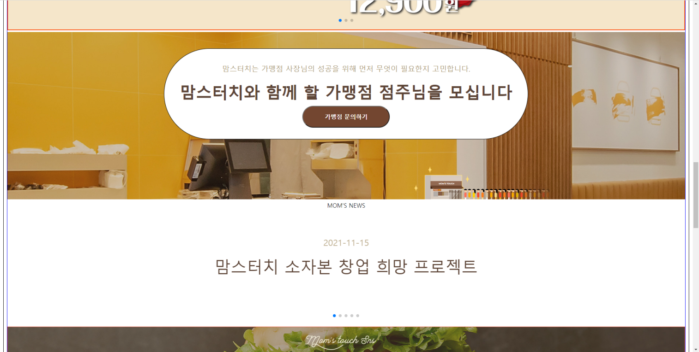
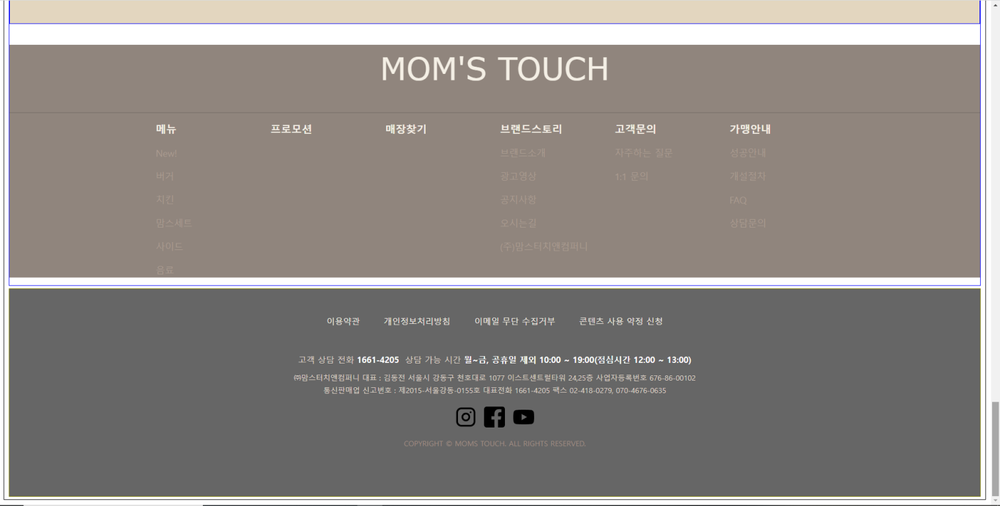

# VSCode
Webpage Clone coding

# MomsTouch Web cite Clone coding

## Program Stacks
- HTML
- CSS
- JavaScript
- JQuery
- BootStrap5

## Explanation
- 유명한 프렌차이즈 맘스터치의 웹 사이트를 클론 코딩한 프로젝트입니다.
- Visual Studio Code를 이용해 해당 웹사이트의 메인 페이지를 구현했습니다.
- 스크롤을 내리면 네비게이션 바가 같이 움직이고 슬라이드를 마우스 커서로 넘길 수 있게하는 등의 여러 기믹을 클론하였습니다.

## After Work
- 해당 메인 페이지를 그대로 구현하는 것에 상당한 어려움이 동반되었습니다.
- 특히나 BootStrap5를 메인으로 사용하며 이를 응용하기 위해 JavaScript를 빈번하게 이용하는 과정을 통해
  JavaScript에 대한 이해도가 높아졌음을 상당히 느낄 수 있었습니다.
